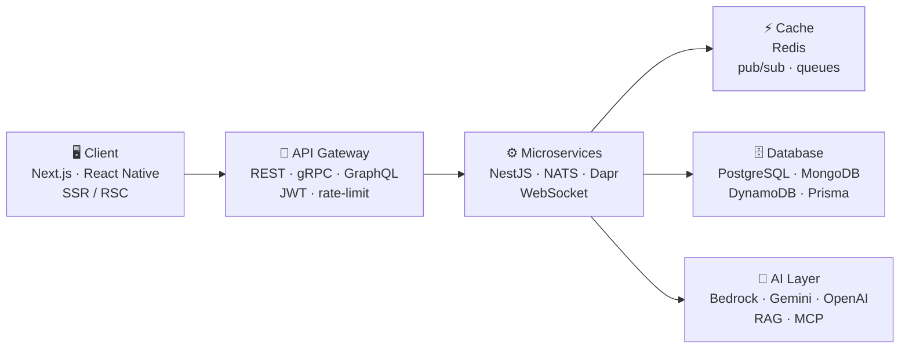

  

  Building for teams in 🇯🇵 Japan &nbsp;·&nbsp; 🇹🇭 Thailand &nbsp;·&nbsp; 🇻🇳 Vietnam

  <a href="https://jarvis-portfolio-three.vercel.app/"><b>Portfolio</b></a> &nbsp;·&nbsp;
  <a href="https://www.linkedin.com/in/tr%E1%BA%A7n-anh-quang-696a51218/"><b>LinkedIn</b></a> &nbsp;·&nbsp;
  <a href="https://www.npmjs.com/package/@jarvis-studio/scheduler-react"><b>npm</b></a> &nbsp;·&nbsp;
  <a href="mailto:taquang.hskx.2000@gmail.com"><b>taquang.hskx.2000@gmail.com</b></a>

---

### About

6+ years shipping products end-to-end — from startup MVPs to systems serving real traffic.
I design full-stack architectures, build AI agents and Web3 apps, and lead teams to deliver them.

- 🏗️ **Architecture first** — microservices over gRPC / NATS, Redis caching, WebSocket streaming
- 🤖 **AI in production** — RAG, MCP tooling and agent state on Bedrock · Gemini · OpenAI
- 🎨 **Frontend that feels good** — React / Next.js, plus Three.js + GLSL when the product deserves it
- 👥 **Tech Lead** — team of 6, code standards, reviews, mentoring
- 🎮 **Nights & weekends** — indie games shipped to the App Store & Google Play, plus a native iOS app

---

### Tech stack

---

### How I build at scale

End-to-end ownership — from client apps down to services, cache, data, infra and the AI layer.

---

### Selected work

**Client & product work**

| Project | Role | What it is |
| --- | --- | --- |
| **BuddyTrading** | Fullstack | Crypto trading platform — realtime market data, NestJS microservices (gRPC / NATS / Dapr), Redis, WebSocket streaming, Hummingbot bots, Solidity contracts. |
| **Abili AI Platform** | Fullstack | Multi-LLM agent platform for a Japanese client — AWS Bedrock + Gemini, RAG search, MCP tooling, agent state on DynamoDB. |

**Shipped games — designed, built & released solo**

| Game | Play now | Stores | Built with |
| --- | --- | --- | --- |
| **Vietnam Tower** (Tháp Phố Việt) | [web](https://vietnam-tower-builder.vercel.app/) | [App Store](https://apps.apple.com/us/app/vietnam-tower/id6786195621) | Stack-tower game covering all 63 Vietnamese provinces — Phaser + TypeScript + Vite + Capacitor, 64 unlockable themes, deterministic daily challenge, combo & power-up system, PWA, VI/EN, Vitest on the pure game logic |
| **Whack-a-Mole** | [web](https://whack-a-mole-web.vercel.app/) | [App Store](https://apps.apple.com/app/6779471870) · [Google Play](https://play.google.com/store/apps/details?id=com.jarvis2192.studio.vn.whackamole) | Ad-free mobile arcade — 600 levels in Unity, plus a Next.js landing & privacy site |
| **Glimmerling** | [web](https://glimmerling.vercel.app/) | iOS — coming soon | Unity 2D lantern-maze game for kids: engine-free C# core (seeded generation, BFS placement, Bresenham line-of-sight) covered by NUnit tests, procedurally generated royalty-free audio, SSR/SSG marketing site |

**Open source & live demos**

| Repo | Live | Stack |
| --- | --- | --- |
| [react-scheduler](https://github.com/Jarvis219/react-scheduler) | [npm](https://www.npmjs.com/package/@jarvis-studio/scheduler-react) | Headless React scheduling library — calendar, resource, timeline & Gantt views |
| [personal-dashboard](https://github.com/Jarvis219/personal-dashboard) | [demo](https://personal-dashboard-xi-eight.vercel.app) | 10 drag-and-drop widgets, weather-reactive backgrounds, PWA, Supabase realtime sync |
| [3D-workspace-configurator](https://github.com/Jarvis219/3D-workspace-configurator) | [demo](https://3d-workspace-configurator.vercel.app) | Desk configurator — R3F, 78 procedural furniture items, PBR, undo/redo, no external GLBs |
| [retro-synthwave-endless-runner](https://github.com/Jarvis219/retro-synthwave-endless-runner) | [demo](https://retro-synthwave-endless-runner.vercel.app) | 3D endless runner — Three.js, 8 power-ups, procedural Web Audio synthwave soundtrack |
| [solar-system-3d](https://github.com/Jarvis219/solar-system-3d) | [demo](https://solar-system-3d-lime.vercel.app) | Interactive solar-system explorer in Three.js |
| [Game-Sky-Guardian](https://github.com/Jarvis219/Game-Sky-Guardian) | [demo](https://game-sky-guardian.vercel.app) | HTML5 Canvas space shooter — React 19 + Vite |
| [Destiny](https://github.com/Jarvis219/Destiny) | [demo](https://destiny-alpha-two.vercel.app) | Vietnamese astrology (Tử Vi) — 100% client-side calculation, no backend |

**Interactive labs** — live, source private

| Lab | Live | What it is |
| --- | --- | --- |
| **Four Seasons** | [fairy-tale-seasons.vercel.app](https://fairy-tale-seasons.vercel.app) | Interactive 3D fairy-tale island flowing through spring → winter — cherry blossoms, fireflies, falling leaves and snow, with day/night and weather. Three.js |
| **Crypto Data Space** | [crypto-data-space.vercel.app](https://crypto-data-space.vercel.app) | The crypto market as a sci-fi 3D universe — planets orbit, glow and react to price movement. Vite + React Three Fiber + Web Audio |
| **MetaMask Social Login** | [metamask-social-pi.vercel.app](https://metamask-social-pi.vercel.app) | Wallet onboarding without seed phrases — social sign-in + password, Web3 UX experiment |

**Currently building** (private repos — happy to walk through the code or architecture on request)

- **LinguaFlow** — native iOS English-learning app. Swift / SwiftUI, Supabase (Postgres, Auth, Edge Functions, Realtime), SwiftData offline cache, AVFoundation + Speech for shadowing. BYOK AI: users bring their own Gemini / Claude / OpenAI key, stored in Keychain.
- **story-video** — local-first storytelling video pipeline: topic → LLM script → human review → voice → rendered video, scene as the unit of everything.

---

### Experience

| | |
| --- | --- |
| **2023 — Present** | **Team Lead & Tech Lead** · Kiaisoft — fullstack architecture, team leadership, mentoring, AI / LLM |
| **2022** | **Frontend Developer** · Icetea Labs — Next.js, Web3, standardized & unit-tested code |
| **2020 — 2022** | **Frontend Developer** · Teneocto Technology — React, Angular, TypeScript |

---

  Open to freelance, consulting and Tech Lead / AI roles — usually replies within 24h. 
  <a href="mailto:taquang.hskx.2000@gmail.com">taquang.hskx.2000@gmail.com</a> ·
  <a href="https://jarvis-portfolio-three.vercel.app/">jarvis-portfolio-three.vercel.app</a>

